# Fluxos Detalhados do Sistema de Gestão de Projetos

## 🔄 Fluxos Principais do Sistema

### 1. **Fluxo de Autenticação e Autorização**

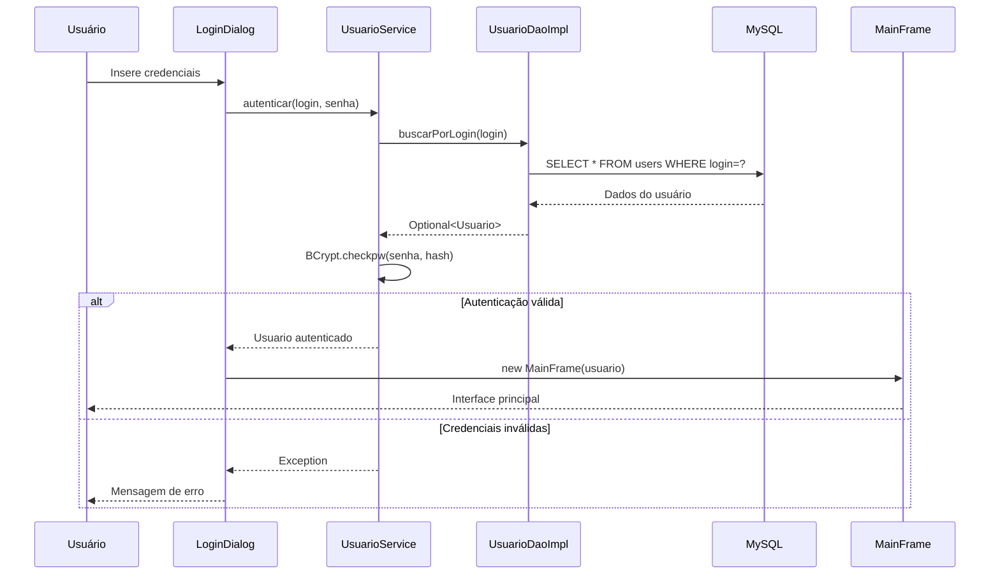

**Componentes Envolvidos:**
- **LoginDialog**: Captura credenciais
- **UsuarioService**: Validação e lógica de autenticação
- **UsuarioDaoImpl**: Acesso aos dados do usuário
- **BCrypt**: Hash de senhas para segurança

---

### 2. **Fluxo CRUD de Projetos**

#### 2.1 Criação de Projeto
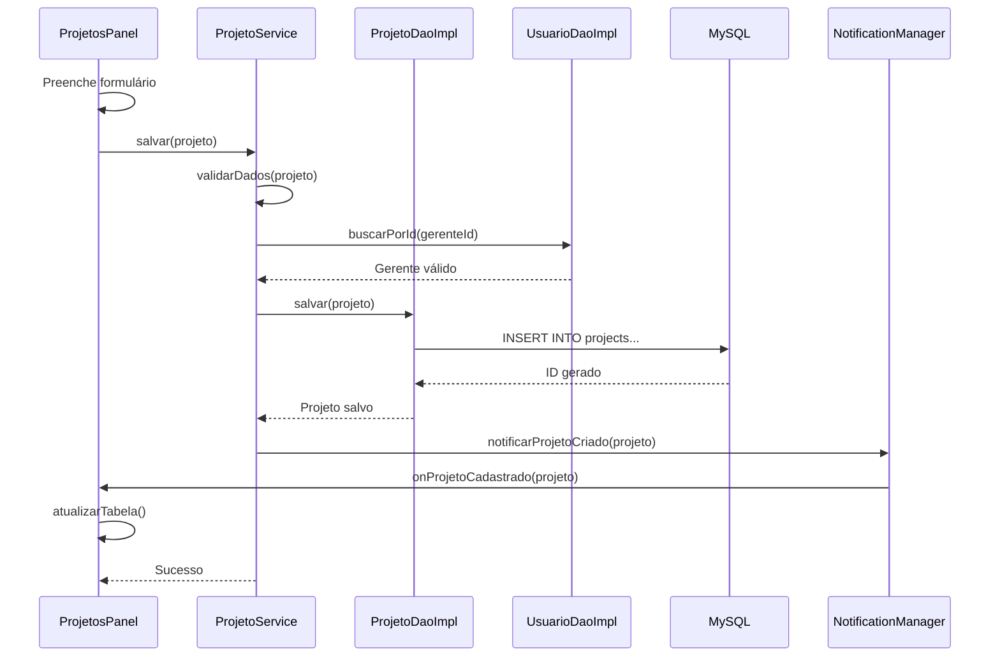

#### 2.2 Listagem de Projetos
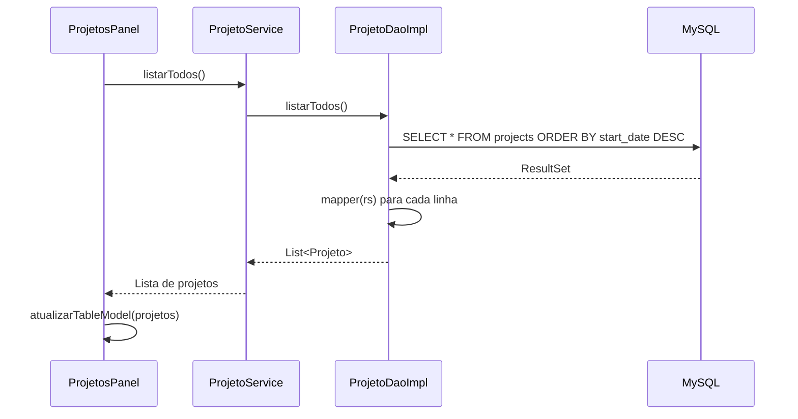

---

### 3. **Fluxo de Gestão de Tarefas**

#### 3.1 Criação de Tarefa
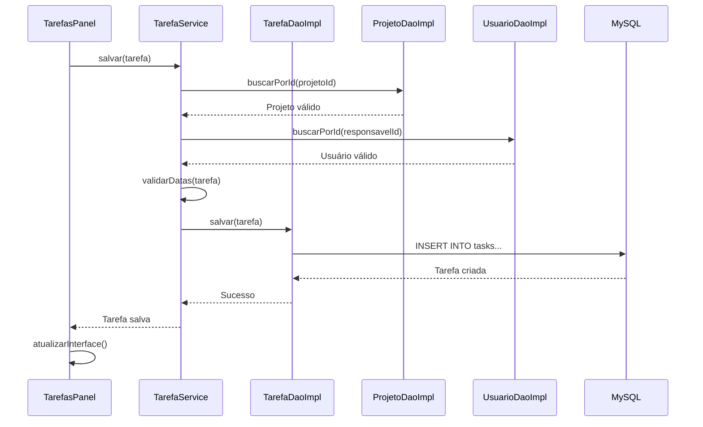

#### 3.2 Atualização de Status
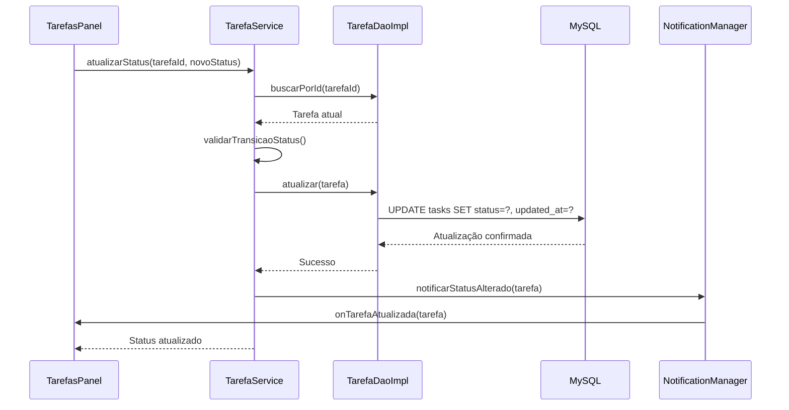

---

### 4. **Fluxo de Alocação Projeto-Equipe**

#### 4.1 Vinculação de Equipe a Projeto
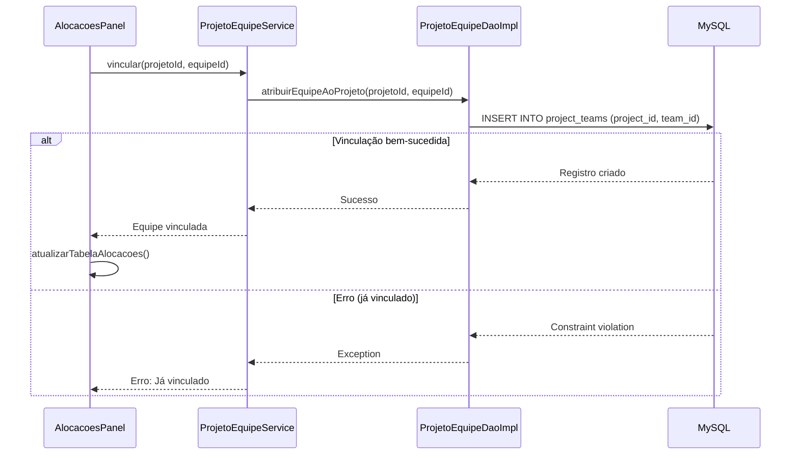

#### 4.2 Relatório de Alocações
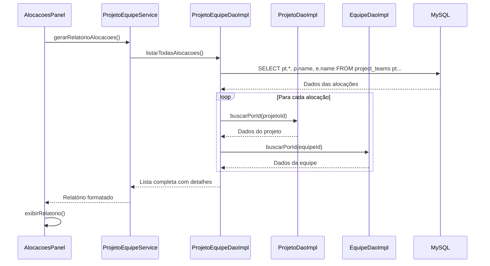

---

### 5. **Fluxo de Notificações (Observer Pattern)**

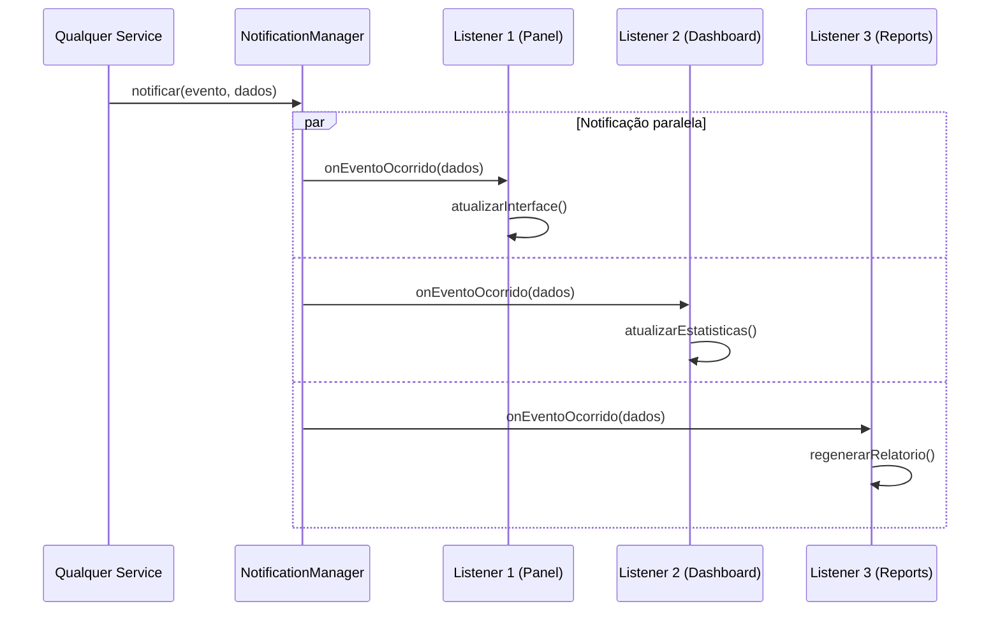

**Eventos Suportados:**
- `onUsuarioCadastrado(Usuario)`
- `onUsuarioAtualizado(Usuario)`
- `onProjetoCriado(Projeto)`
- `onProjetoStatusAlterado(Projeto)`
- `onTarefaCriada(Tarefa)`
- `onTarefaStatusAlterada(Tarefa)`
- `onEquipeFormada(Equipe)`
- `onAlocacaoRealizada(ProjetoId, EquipeId)`

---

### 6. **Fluxo de Inicialização do Sistema**

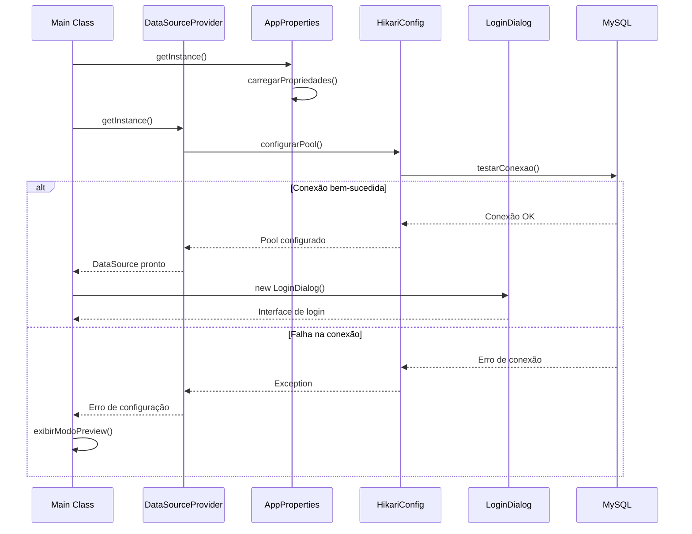

---

### 7. **Fluxo de Validações**

#### 7.1 Validação de CPF
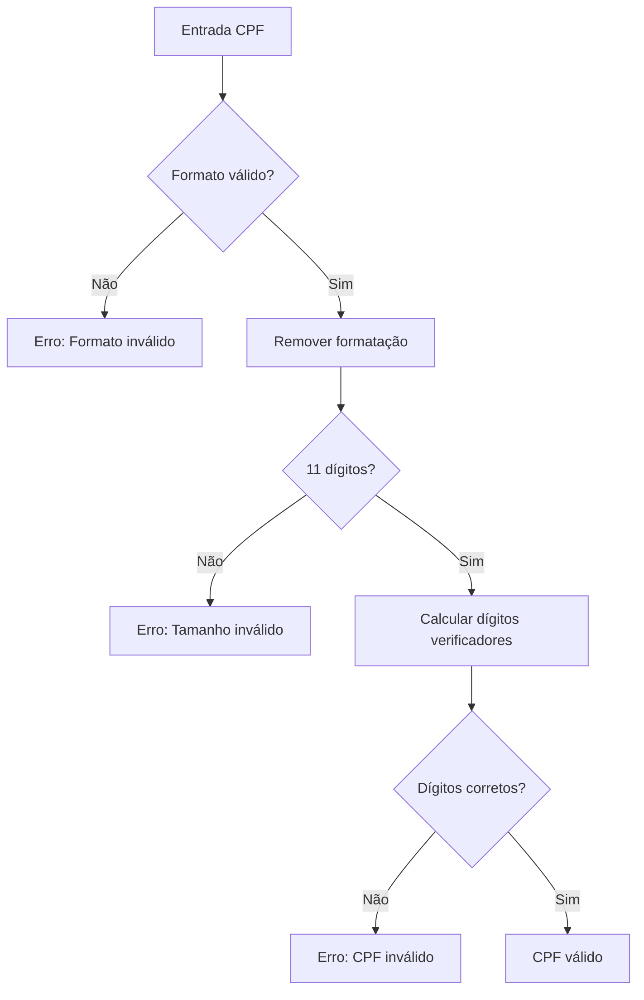

#### 7.2 Validação de Datas de Projeto
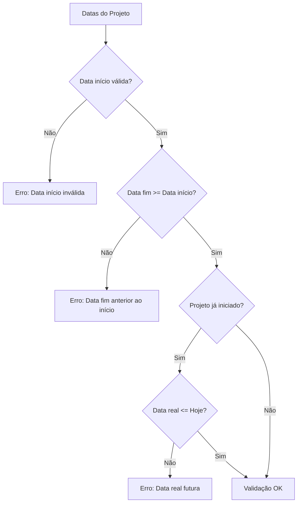

---

### 8. **Fluxo de Relatórios e Dashboard**

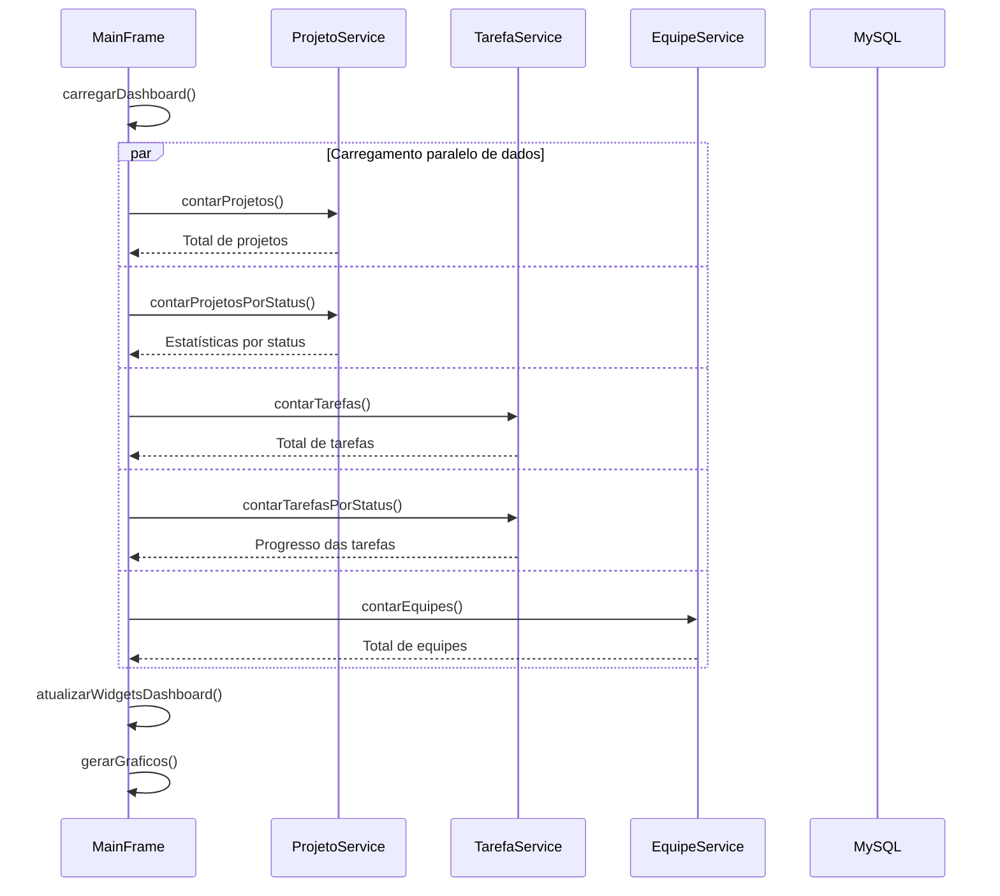

---

## 🔧 Configurações e Otimizações

### **Pool de Conexões HikariCP**
```java
// Configuração otimizada para o sistema
HikariConfig config = new HikariConfig();
config.setMaximumPoolSize(10);           // Máximo 10 conexões
config.setMinimumIdle(2);                // Mínimo 2 conexões ociosas
config.setConnectionTimeout(30000);      // Timeout de 30s
config.setIdleTimeout(600000);           // Idle timeout de 10min
config.setMaxLifetime(1800000);          // Vida máxima de 30min
config.setLeakDetectionThreshold(60000); // Detecção de vazamentos
```

### **Transações e Integridade**
- **Autocommit**: Desabilitado para operações críticas
- **Isolation Level**: READ_COMMITTED
- **Rollback**: Automático em caso de exceções
- **Prepared Statements**: Prevenção de SQL Injection

### **Performance e Monitoramento**
- **Índices**: Criados em colunas de busca frequente
- **Logs**: Operações críticas registradas
- **Cache**: Dados de configuração em memória
- **Validação**: Client-side e server-side

Este documento detalha todos os fluxos principais do sistema, mostrando como os componentes interagem para fornecer as funcionalidades completas de gestão de projetos.